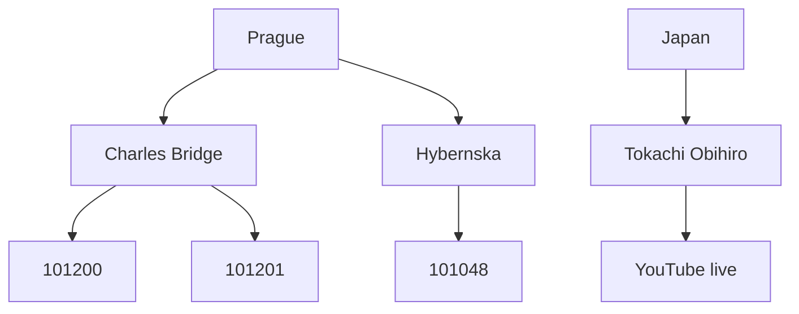

# CCTV agent

Python package for multimodal CCTV analysis, with a FastAPI chat API and a React UI.

## Docs

- [Agent runtime, camera tools, routing, and external services](docs/AGENT.md)

## Camera catalog hierarchy

Configured cameras are grouped **sector → location → camera**. The committed catalog has **Prague** (10 locations, 14 cameras) and **Japan** (1 location, 1 YouTube livestream) — 15 cameras total. See [AGENT.md](docs/AGENT.md) for schema, enablement rules, and runtime flow.



## Features

- **Camera-first chat**: the agent fetches live JPEGs from configured cameras before answering.
- **Three-level enablement**: sector AND location AND camera toggles in the Config panel.
- **Three independent tool toggles** (`internet`, `weather`, `maps`) via `GET/PUT /api/config`.
- **External tools** (when enabled): DuckDuckGo web search, Open-Meteo weather, OpenStreetMap Nominatim map lookup.

Toggles take effect on the next chat message. External services are demo/research-grade public APIs without uptime guarantees.

## Run locally

API (from this directory):

```bash
uv sync
uv run cctv-api
# or: uv run uvicorn cctv.api.app:app --reload --port 8000
```

UI:

```bash
cd frontend
npm install
npm run dev
```

The Vite app is at http://localhost:5173 and proxies `/api` to port 8000. Azure OpenAI credentials come from the environment (never from the frontend).

## Tests

```bash
uv run pytest
```

Default tests mock external HTTP; no live network required.
