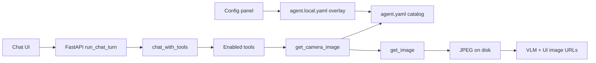
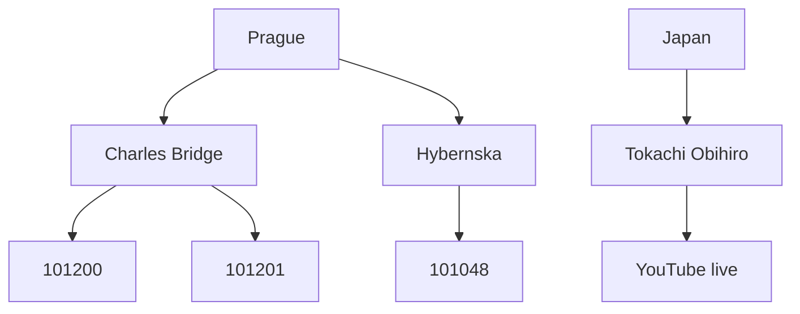
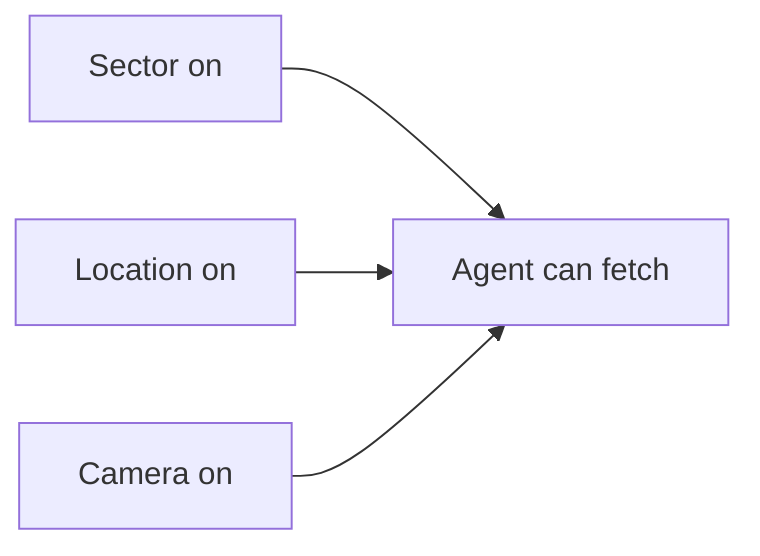

# CCTV agent runtime

This project uses a **custom Azure OpenAI function-calling loop**, not [Deep Agents](https://docs.langchain.com/oss/python/deepagents/overview) (LangGraph). Deep Agents is a harness for long-running work (planning files, a virtual filesystem, subagents, summarization). Here the job is: read configured cameras, fetch a still, show it to the vision model, answer in chat.

Stay on this loop because:

- Frames are injected as JPEG parts after a tool returns a file path. LangChain-style tool results are usually text; we would still custom-wire vision.
- Azure is already called with `api-key` headers in `cctv.utils.azure`.
- The React UI talks only to FastAPI. Swapping the agent runtime would not change the HTTP contract.

Revisit Deep Agents only if you need long research traces, parallel subagents, or LangSmith as a thesis chapter. Tools are registered in one place so fetch code would not need a rewrite.

## Layout

| Piece | Role |
| --- | --- |
| `frontend/` | React chat + config panel |
| `src/cctv/api/` | FastAPI: config, conversations, image files |
| `src/cctv/analysis/azure_vision.py` | `chat_with_tools` loop |
| `src/cctv/tools/` | Tool schemas + executors |
| `configs/agent.yaml` | Committed camera catalog and default tool flags |
| `configs/agent.local.yaml` | Gitignored overlay: toggles, extra/edited cameras |
| `src/cctv/fetch/image_source.py` | Low-level `get_image(source)` (URLs, Prague ids, YouTube live) |



## Config (`configs/agent.yaml` + `configs/agent.local.yaml`)

`configs/agent.yaml` is the committed catalog (demo cameras, default flags). `GET/PUT /api/config` merges that with gitignored `configs/agent.local.yaml`. The Config panel only writes the overlay: tool toggles, extra cameras/locations, edits, and removals. Updating the catalog in git still applies unless the overlay overrides the same id.

```yaml
sectors:
  - id: prague
    name: Prague
    enabled: true
  - id: japan
    name: Japan
    enabled: true
locations:
  - id: charles_bridge
    name: Charles Bridge
    sector_id: prague
    enabled: true
    lat: 50.0865
    lon: 14.4119
cameras:
  - id: charles_bridge
    name: Charles Bridge
    source: "https://.../cameras/101200/image"
    sector_id: prague
    location_id: charles_bridge
    enabled: true
tools:
  internet: false   # Internet search (web_search via DuckDuckGo)
  weather: false    # Open-Meteo measured/forecast data
  maps: false       # OpenStreetMap Nominatim place search / reverse geocode
```

### Catalog hierarchy

Config is **sector → location → camera**. GPS lives on **locations**; cameras inherit location coordinates for routing and prompts unless a camera sets its own optional override.

Committed catalog counts:

| Level | Count | Notes |
| --- | --- | --- |
| Sectors | 2 | Prague, Japan (+ implicit Unassigned for legacy) |
| Locations | 11 | 10 Prague + 1 Japan (Tokachi-Obihiro) |
| Cameras | 15 | 14 Prague HTTP stills + 1 YouTube livestream |



Prague locations come from `src/cctv/fetch/monitor_config.json` plus Mariánské náměstí (`101164`). Japan uses the Tokachi-Obihiro YouTube livestream (`IDXRscHtp2s`).

### Sectors, locations, and effective enablement

Each **sector**, **location**, and **camera** has an `enabled` toggle. A camera is **effectively enabled** only when **all three** are on:

`sector.enabled AND location.enabled AND camera.enabled`



- Disabled entries stay in YAML; child switches keep their saved state when a parent is off.
- They are excluded from `list_cameras`, the system prompt, and successful `get_camera_image` fetches.
- Legacy configs without `locations` or `location_id` load under an implicit **Unassigned** location under the camera’s sector (or global Unassigned).
- The overlay merges sectors, locations, and cameras by id: changed entries, `remove_*_ids`, and optional `tools`.
- Saving rejects removing a **location** while any camera still references it, or removing a **sector** while any location (or camera) still references it (HTTP 400 from `PUT /api/config`).

Legacy overlays may still contain `google_maps`; it is loaded as `maps`. Turning `internet` on alone does **not** enable weather.

`GET` returns the merged config. Tool toggles take effect on the **next chat message** without restarting the API.

If a place is missing, the agent should tell the user to add it in the Config panel (name, location GPS, source). It must not invent URLs.

## Camera-first routing

The system prompt (`src/cctv/config/prompt.py`) instructs the model to:

- Fetch **all configured cameras** that match a named place (by name or GPS area) in **one** `get_camera_image` call (`cameras: [...]`), not a single random sample and not one tool call per camera.
- For questions with **no location**, sample **one camera per configured location** when locations exist (otherwise fall back to GPS clustering).
- Prefer a **soft cap of ~10 images** per turn; allow more when a place-wide question needs it (Prague-wide fetch is 14 frames; hard cap 16).
- Describe **visible** conditions from camera frames first.
- Use `get_weather` only when the Weather toggle is on, and clearly label measured/forecast data vs camera-observed conditions.
- Use `web_search` for news/context when Internet search is on — **not** as a weather API.
- Never claim Internet, weather, or map capabilities when those toggles are off.

`run_chat_turn` reloads merged config before every user message and passes `max_tool_rounds=16` so a generous camera batch plus optional external calls can complete.

## Model-facing tools

Tools exposed to Azure depend on the current toggles (`cctv.tools.tool_schemas_for_config`):

| Name | When enabled | Effect |
| --- | --- | --- |
| `list_cameras` | always | JSON list of **effectively enabled** cameras (id, name, GPS, source, source_type, sector_id, location_id, location_name) |
| `get_camera_image` | always | Resolves YAML `source` for one or more **effectively enabled** cameras, fetches stills (in parallel), returns metadata + JPEG paths; disabled or unknown ids return a clear error per camera |
| `web_search` | `internet` | Up to 5 DuckDuckGo text results (title, URL, snippet) via `ddgs` |
| `get_weather` | `weather` | Open-Meteo current conditions + 3-day forecast (coordinates or place name) |
| `search_map` | `maps` | Nominatim place search (≤5 results) |
| `reverse_geocode` | `maps` | Nominatim reverse lookup for coordinates |

All executors are registered in `src/cctv/tools/__init__.py`. Only enabled schemas are sent to Azure; absence from the schema list is the capability gate.

Low-level `get_image(source)` remains as **implementation** (and is registered for notebooks/tests). It is not in the default model tool list.

### External service limits (demo / research grade)

These are free public services without uptime guarantees:

| Service | Module | Limits / notes |
| --- | --- | --- |
| DuckDuckGo (`ddgs`) | `web_search.py` | Max 5 results; empty/rate-limited responses return a tool error |
| Open-Meteo | `weather.py` | No API key; geocoding via Open-Meteo search API |
| Nominatim | `maps.py` | Identifying User-Agent, in-memory cache (~1 h), serialized ≤1 req/s |

External failures return a tool result (not a chat crash) so the model can explain that the source was unavailable.

After `get_camera_image` succeeds, `chat_with_tools` appends a user message containing the JPEG(s) so the VLM can see the frames. FastAPI copies those paths to `imageUrls` like `/api/images/...` for the chat UI. Do not put large base64 blobs in the transcript JSON. The tool accepts `cameras: [id or name, ...]` (and `camera` for a single name). There is a preferred cap of about 10 images and a hard cap of 16.

## How to add a tool

1. Add `YOUR_TOOL` schema and `execute_your_tool(arguments) -> { "tool_content": str, "image_path": str | None, "image_paths"?: list[str] }` in `src/cctv/tools/`.
2. `register_tool(YOUR_TOOL, execute_your_tool)` in `src/cctv/tools/__init__.py`.
3. Wire the name into `tool_names_for_config` in `registry.py` if it is toggle-gated, or `_BASE_NAMES` if always on.
4. Mention it in `build_system_prompt` if the model needs extra policy.
5. Add a unit test that calls `execute_tool("your_tool", ...)` with HTTP mocked.

The chat loop already dispatches by name and injects any `image_path` / `image_paths`.

## HTTP API (chat)

- `GET/PUT /api/config` — `sectors`, `locations`, `cameras`, `tools`: `{ "internet": bool, "weather": bool, "maps": bool }`
- `POST /api/conversations`
- `GET /api/conversations/{id}`
- `POST /api/conversations/{id}/messages` with `{ "content": "..." }` — full transcript after the turn
- `GET /api/images/{relative-path}` — JPEG under the data directory only

Conversations are in memory and reset when the API process stops. There is no streaming.

## Run

From the Python project root (`Project/multimodal-cctv-surveilance`):

```bash
uv sync
uv run cctv-api
# or: uv run uvicorn cctv.api.app:app --reload --port 8000
```

Frontend:

```bash
cd frontend
npm run dev
```

Open http://localhost:5173. Vite proxies `/api` to port 8000. Set Azure OpenAI env vars for the API process.

## Tests

Default pytest uses mocked HTTP — no live network:

```bash
uv run pytest
```

## Config panel UI

The sidebar groups cameras into collapsible **sector accordions**, each containing nested **location accordions**:

- **Sector switch** — top-level enable toggle; persists immediately (optimistic update with rollback on failure).
- **Location switch** — middle-level enable toggle; same immediate persistence. When the sector is disabled, location switches show saved state but are non-interactive.
- **Camera switch** — leaf enable toggle; same immediate persistence. When the sector or location is disabled, camera switches show saved state but are non-interactive; parents are visually muted.
- **Active count** — number of cameras that are effectively enabled in that sector or location.
- **Structural edits** (sector/location/camera names, assignments, add/remove) are local until **Save configuration**.
- **Location removal** is blocked while cameras are assigned; **sector removal** is blocked while locations (or cameras) are assigned. The UI shows the reason and the API returns 400.
- Accordion expand/collapse is UI-only and not persisted.

## Out of scope

- Deep Agents / LangGraph
- Typed clarifying-question protocol
- Auth, Docker, conversation persistence, streaming
- Turn-by-turn routing / navigation (Nominatim is place context only)
